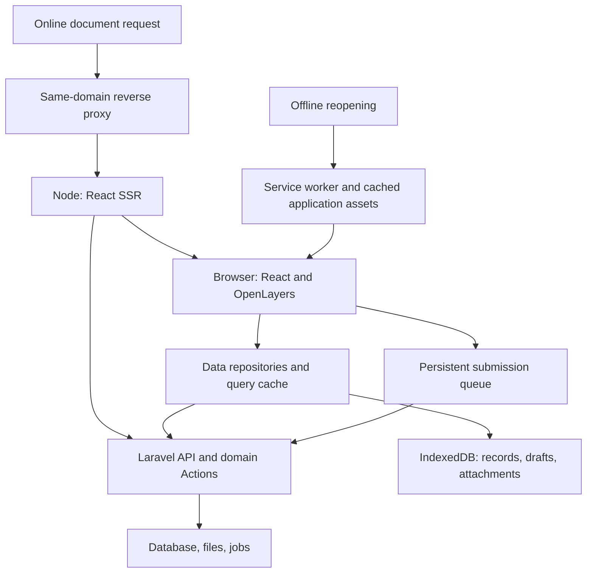
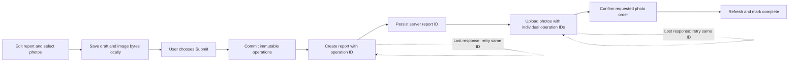
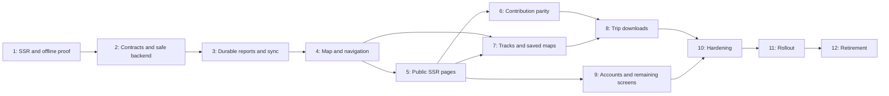

# Rodnik: React, SSR, and offline rewrite plan

Prepared September 27, 2026. Status: proposed implementation plan; no application rewrite has been started.

The target is a complete replacement of the public and account frontend with React, using React Router Framework Mode for server rendering, Laravel for the API and business rules, and browser storage for offline use. The first stage proves the hardest architectural combination on one spring page: meaningful server-rendered HTML, interactive React navigation, and reopening a downloaded page without a connection.

The plan preserves the existing database, identifiers, URLs, files, imports, jobs, permissions, and administrative backend. Filament remains the operational administration interface. Moderation controls embedded in public pages are included in the React migration. Replacing Filament itself would be a separate scope expansion.

The stages below are completion gates, not calendar estimates. A stage is complete when its user behavior and failure cases are demonstrated. Effort estimates should be made after Stage 1 establishes the SSR/offline startup approach and production infrastructure has been inventoried.

Navigation: [application structure](#target-application-structure) · [existing feature coverage](#existing-behavior-the-rewrite-must-cover) · [data and user flows](#data-ownership-and-application-flows) · [API and sync contract](#api-and-synchronization-contract) · [SEO contract](#seo-and-url-migration-contract) · [deployment and rollback](#deployment-and-update-contract) · [verification](#verification-matrix) · [dependencies and decisions](#dependencies-parallel-work-and-planning-checkpoints).

## Stage 1 — Prove one spring page with SSR and offline reopening

**Outcome:** one real spring page works online before JavaScript executes and works offline after an explicit download. This is the first implementation work, before converting the rest of the application.

### 1.1 Capture the behavior being preserved

Use a small, representative fixture set: a visible spring with reports/photos, a spring without reports, a merged spring, a hidden spring, and a missing identifier. Record the existing HTML, HTTP status, canonical URL, language alternatives, report ordering, and redirect behavior in English and Russian.

Canonical spring URLs currently include trailing slashes: /123/ and /ru/123/. The roots are / and /ru. Preserve those exact forms. Capture the old page and API behavior separately: their visibility and redirect semantics differ.

### 1.2 Build the smallest production-shaped frontend

- Add a frontend package within this repository, using React, TypeScript, Vite, and React Router Framework Mode with SSR.
- Define the PWA manifest identity, start URL, scope, display mode, and suitable icons; verify installation separately from offline capability.
- Select and lock compatible stable dependency versions after checking their actual compatibility. Use conventional SSR/client components; experimental React Server Components are unnecessary for this plan.
- Run Node SSR alongside Laravel through a local same-origin reverse proxy. Match the intended production request routing instead of relying only on the Vite development server.
- Introduce a thin Laravel web read contract for this page. Reuse existing queries, resources, policies, and Actions where applicable, while preserving web-specific behavior.
- Render the spring name/type, coordinates, visible report content, author links, image markup, and SEO metadata in the HTML response.
- Keep OpenLayers in a browser-only component with a stable server-rendered placeholder. Text content must remain accessible independently of map initialization.
- Hydrate React from exactly the server-provided data. Avoid an immediate duplicate fetch and avoid replacing meaningful HTML with a loading screen.

### 1.3 Prove a separate offline startup path

Add a minimal service worker and IndexedDB database. An explicit “Save for offline” action persists this spring's public data and the application assets needed to display it.

The cached application must be able to start at the original spring URL without contacting Node or PHP. This needs an intentional offline bootstrap document and client data-loading path; merely adding a manifest, caching JSON, or setting SSR to true does not accomplish it.

Stage 1 must settle how the selected React Router release builds that offline entry. Prefer a generated entry that shares route definitions, page components, and data types with the SSR app. Do not hydrate a generic cached document as though it contained another spring's SSR data. A dedicated offline entry may render the shared components from scratch.

Include all necessary route metadata, route chunks, translations, CSS, and fonts in the offline asset set. React Router's lazy route discovery can make additional network requests; either include the required route manifest initially or explicitly persist it with the downloaded route assets. See [React Router route discovery](https://reactrouter.com/explanation/lazy-route-discovery).

Use one additional lightweight route, such as the root shell, to prove that offline navigation and back/forward work. This must be an application startup proof, not just a static snapshot of one page.

### 1.4 Acceptance gate

- A fresh online request with JavaScript disabled contains actual spring/report text, ordinary links, and correct SEO tags.
- English and Russian versions agree with the existing canonical and locale rules.
- Hydration is free of mismatches; the map loads independently.
- Download the spring, disconnect, close the tab, reopen its exact URL, and read the saved data.
- Repeat after browser restart on actual iOS Safari and Android Chrome as well as automated desktop browsers.
- Navigate between cached routes and use back/forward offline.
- An undownloaded spring shows “Not downloaded”; it does not claim the server returned 404.
- A photo is available offline only if its bytes were downloaded. Otherwise show an honest placeholder.
- Reconnection refreshes the record without destroying local UI state; the page shows when its stored data was last refreshed.
- Online missing/hidden/merged responses retain their intended HTTP and visibility semantics.
- With Node SSR unavailable, online requests take a tested legacy fallback or return an appropriate temporary failure. They do not silently become empty successful pages.
- Cache inspection confirms that no session, CSRF token, or account-specific HTML was stored in the generic offline shell.

**Deliverables:** a runnable production-build prototype, a route/SEO fixture matrix, automated SSR and offline-restart tests, a short architecture decision recording the offline entry design, and measurements of HTML response time, asset size, and cold/offline startup.

**Release boundary:** local and staging first. Do not install a root-scope service worker on the production site during this proof. The legacy frontend remains the production renderer.

## Target application structure

### One product, two rendering environments, one authoritative backend

Online initial visits receive HTML rendered by Node using data from Laravel. Subsequent interactions run in the browser. Offline visits start the cached browser application and use locally saved records. The page components and domain data types are shared across both rendering paths.

Laravel remains authoritative for visibility, authorization, validation, water scores, report ordering, revisions, map versions, imports, notification delivery, and database changes. Node handles rendering and frontend request coordination. It does not independently reproduce those business rules or access the database directly.

React Router supports combining a server loader for initial SSR with a client loader for later navigation. Our client loader will call the application's local/network data layer; a server-only parent loader must not make the offline route tree unusable. See [React Router data loading](https://reactrouter.com/start/framework/data-loading).



### Proposed repository layout

The following paths are proposed new structure, not an inventory of existing files.

```text
rodnik/
  app/
    Actions/                     Existing business operations, extended for safe sync
    Http/Controllers/Api/Web/V1/ Browser and SSR HTTP endpoints
    Http/Requests/Api/Web/V1/    Input validation contracts
    Http/Resources/Api/Web/V1/   Public/private response representations
    Policies/                    Existing permissions
    Support/                     URL resolution, metadata, geometry, versions
    Filament/                    Retained operational administration
  routes/
    web.php                      Legacy pages during migration, auth, utilities
    api/v1.php                   Existing external/mobile contract, preserved
    api/web-v1.php               Proposed new web API route file
  frontend/
    app/
      root.tsx                   Document and application shell
      routes.ts                  Central route definitions
      routes/                    Thin SSR/client route adapters
      features/
        springs/ reports/ photos/ map/ tracks/ saved-maps/
        downloads/ account/ users/ content/ moderation/
      components/                Shared accessible UI primitives
      data/
        api/                     HTTP client and generated contract types
        repositories/            One read/write interface per feature
        queries/                 Query keys and query-cache adapters
        local/                   IndexedDB schema and data migrations
        sync/                    Queue runner, dependencies, receipts, conflicts
      map/                       OpenLayers adapters, sources, styles, workers
      seo/                       Metadata adapters and structured-data rendering
      i18n/                      Translation loading and formatting
      platform/                  Browser-only storage, connectivity, file access
      server/                    SSR-only Laravel transport and request context
      entry.client.tsx
      entry.server.tsx
    offline/                     Offline entry sharing routes/features
    service-worker/              Explicit caching, download, and update behavior
    tests/                       Unit, integration, browser and SSR tests
    react-router.config.ts
    vite.config.ts
    package.json
  contracts/
    web-api.yaml                 Proposed API specification
    fixtures/                    Compatibility and response examples
  tests/                         Existing and expanded Laravel/Pest tests
  ops/                           Proposed proxy/process/deploy examples and runbooks
```

Route modules resolve parameters, load data, set metadata, and render feature components. They should remain small. Components must not each invent their own fetch, retry, storage, or authentication behavior.

A feature module owns its screens, forms, domain-facing UI, and presentation logic. Repositories own data access. The synchronization runner owns submission retries. OpenLayers objects remain inside a map adapter rather than becoming general React state.

### Runtime and route ownership

| Request class | Owner during migration | Final owner |
|---|---|---|
| Migrated page GET/HEAD requests | Node SSR for the selected cohort | Node SSR |
| Unmigrated page GET/HEAD requests | Laravel legacy frontend | Node after that feature passes its gate |
| Browser API requests | Laravel | Laravel |
| Existing external/mobile API | Laravel, compatible behavior | Laravel |
| Login/logout/password mutation endpoints | Laravel/Fortify | Laravel/Fortify |
| Login/account screen GET/HEAD requests | Legacy initially, then React | Node SSR with private/no-store behavior |
| Sitemaps, robots, exports, file downloads | Laravel/static delivery | Laravel/static delivery |
| First-party spring data tiles | Existing static/PHP routing | Existing routing or versioned data-pack delivery |
| Operational administration | Laravel/Filament | Laravel/Filament |
| Hashed frontend assets | Static server/CDN | Static server/CDN |

Routing must distinguish HTTP method and response type. An existing path can have a React GET page and a Laravel POST handler. HEAD must agree with GET on renderer, status, redirects, and applicable headers. Framework data requests and route-manifest requests must follow the same frontend release as the HTML.

Preserve the same public origin. Use a single route-ownership manifest or generated proxy configuration with tests; avoid two unrelated lists of URL rules drifting apart. SSR's Laravel client uses a configured internal API origin, never a user-supplied host. Preserve the externally visible origin when producing canonical links and redirects.

## Existing behavior the rewrite must cover

This inventory is based on the checked-out repository. Production routing and deployment settings still require verification. A registered route is not proof of an implemented screen: several resource-controller methods are empty.

| Area | Behavior to preserve or resolve deliberately | Main implementation stages |
|---|---|---|
| Home and reports | Root map, report feed, filters, map-area filtering, order, selection, pagination | 4–5 |
| Spring details | Type, coordinates, status, score, visible reports/photos, links, sources, empty states | 1, 5 |
| Resource navigation | Exact URLs, map/query state, back/forward, user context, locale switch | 1, 4–5 |
| Spring contributions | Create, edit, move location, validation, revision history | 2, 6 |
| Reports | Guest/auth creation, owner editing, hiding/restoring, condition flags, dates | 2–3, 6 |
| Photos | Selection, EXIF location, HEIC conversion, resize, order, previews, retry, detach/delete | 3, 6 |
| Moderation in public UI | Hide/restore, merge/unmerge, move/transfer reports, duplicate controls | 6, 9; online operations |
| Tracks | Local GPX import, rendering, route corridor, sharing, library, rename/delete/download | 4, 7 |
| Saved maps | Save/copy/update, title/slug, favorites, search, track binding, shared view | 7 |
| Offline preparation | Selected springs, route corridor, bounded area, chosen basemap | 8 |
| User pages | Contribution context, user spring layer, photo listing, rankings where implemented | 5, 9 |
| Accounts | Login, registration, reset, password confirmation, profile/photo, sessions, deletion, export | 2, 9 |
| Content and utilities | About, legend, contact, exports, privacy, deletion information, API docs, GPX enrichment, statistics | 9 |
| Operations | Heatmap, coverage, admin documentation, Filament and background processes | 9, 12; retained backend where appropriate |
| Search infrastructure | Canonicals, alternates, sitemaps, redirects, robots, real statuses | 1, 5, 10–11 |

Important compatibility findings:

- The web frontend permits anonymous report creation and temporary photo uploads; API v1 currently requires an authenticated user for those mutations. The new API must preserve the web workflow.
- Existing public web views expose a hidden spring with noindex, while API v1 returns 404. Normal merged web links redirect with 301, while API v1 uses 308. Source inspection via redirect=false has separate behavior. Do not substitute the mobile read endpoint without addressing these differences.
- Shared map pages intentionally return no-store and noindex. A shareable link is not permission to add the page to a public cache or search index.
- Spring history currently requires authentication, but a metadata rule marks it indexable. Preserve the access restriction and correct the metadata inconsistency; publishing history would be a separate product decision.
- Saved maps have integer versions and stale-update protection. Reports, spring edits, and track renames need equivalent concurrency design before offline edits are supported.
- Track deletion modifies associated maps and increments their versions. Local copies must reconcile those related changes.
- The web and API photo flows have different attach/detach/delete semantics. Resolve that contract before migration, including retention and cleanup of unattached files.
- The browser has small local/session-storage conveniences but no complete durable offline data model. Current in-memory selected photos cannot be recovered after their tab has already been lost.

Evidence: [web routes](/Users/andrewkolpakov/code/rodnik/routes/web.php), [API routes](/Users/andrewkolpakov/code/rodnik/routes/api/v1.php), [URL resolver](/Users/andrewkolpakov/code/rodnik/app/Support/DuoUrl.php), [indexability rules](/Users/andrewkolpakov/code/rodnik/app/Support/LocalizedUrl.php), [web report creation](/Users/andrewkolpakov/code/rodnik/app/Livewire/Reports/Create.php), [shared map controller](/Users/andrewkolpakov/code/rodnik/app/Http/Controllers/MapController.php), [track deletion](/Users/andrewkolpakov/code/rodnik/app/Actions/DeleteTrackAction.php).

## Data ownership and application flows

### What lives where

| Data | Authoritative location | Browser behavior |
|---|---|---|
| Published springs, reports, photos, permissions, scores | Laravel database/files | Store public snapshots with revision and fetch time |
| Downloaded area contents | A versioned server snapshot/package contract | Persist manifest and downloaded items |
| Private map/track library | Laravel, scoped to account | Cache selected records under the original account |
| Unsubmitted report/edit draft | IndexedDB on this device | Autosave independently of network or query expiry |
| Selected image bytes | IndexedDB Blob records | Keep until safely uploaded or explicitly discarded |
| Submitted but unacknowledged operations | IndexedDB outbox plus server receipts | Retry the same immutable operation ID |
| Published result receipt | Laravel operation/resource identity | Persist the acknowledgement and local/server ID mapping |
| Transient open panel, selection, hover | React state | Persist only what improves restoration |
| Shareable viewport/filter/track context | URL plus normalized map-state model | Restore through one parser and serializer |
| Account credentials | Laravel session cookies | Never store bearer credentials in query caches |
| Guest submission capability | Server-recognized draft identity | Dedicated scoped credential storage; never public/query caches |
| App code, CSS, icons, approved cached images/tiles | Build/server; cached copies in Cache Storage | Version and bound caches separately from drafts |

TanStack Query manages request lifecycles and the UI's current server-data view. Dexie/IndexedDB owns durable records, downloaded content, drafts, attachments, and the outbox. A repository coordinates both. Query cache expiration must never delete unsent work. Query keys include locale and account scope where relevant.

Proposed IndexedDB stores are public entities, private entities, drafts, attachments, operations, operation receipts, local/server ID mappings, download manifests/items, and schema metadata. Each stored record has a schema version. Local drafts retain base server revision and base values where conflict comparison is needed.

### Flow A — First online page load and later navigation

1. The proxy resolves the URL to the current frontend owner.
2. Node asks Laravel for the page's public representation and canonical/visibility resolution.
3. Laravel applies current domain and visibility rules and returns data, metadata, and the intended redirect/status.
4. Node sends meaningful HTML and safely serialized initial data.
5. React hydrates that exact state. IndexedDB access begins after the browser environment is available.
6. The repository persists eligible public data and seeds the client view. Newer local drafts remain separate overlays.
7. Later client navigation displays available local records promptly, then refreshes through the API when reachable.

Create request-scoped SSR caches/query clients. Do not share user-specific request state between Node requests. Public SSR can be cached only when its content is genuinely identical across users. Prefer anonymous public HTML with account controls loaded separately; authenticated pages and account-dependent responses use private/no-store semantics.

Resolve canonical redirects, visibility, authorization, and HTTP status before flushing streamed response headers. A late missing-resource result cannot repair an already-sent 200 status. Essential indexable content and metadata must not depend on an unreliable deferred stream segment.

Date formatting, locale selection, generated IDs, and initial component state must be deterministic during hydration. Browser-only geolocation, map rendering, file processing, and local-database access stay outside server-rendered execution.

### Flow B — Offline reopening

1. A previously installed service worker handles an eligible application navigation.
2. The network is unavailable or times out under the defined fallback policy.
3. It serves the version-compatible offline bootstrap and cached route assets.
4. React resolves the actual current URL and reads its saved data from IndexedDB.
5. Available content shows its saved time; missing content shows a downloadable-data explanation.
6. Reconnection triggers refresh and eligible queued submissions.

This cannot support a user's very first visit with no connection, and it cannot invent data that was never downloaded. Offline availability must be shown at the level of actual content and coverage.

Do not use a universal HTML fallback for API requests, login/reset handlers, exports, assets, administration, or arbitrary missing paths. Online 404/401/403 responses must keep their meaning. Distinguish a network failure from an authoritative application response.

### Flow C — Draft, explicit submission, and synchronization



Typing is autosave, not consent to publish. Explicit submission creates an immutable intent snapshot and its dependency graph in one local transaction. Dependent intents can reference local IDs that do not yet have server IDs. Once predecessor receipts exist, resolve those references and durably freeze the canonical wire payload, base revision, and fingerprint before the operation's first send. Fingerprints describe logical content and file hashes, not volatile multipart boundaries. A report can be uploaded while its photos are still pending; the UI must describe that partial state.

If the user edits after submitting, keep a new local revision. Do not modify the payload of an operation that may already have reached the server. A later edit becomes a new versioned update operation.

### Flow D — Expired session, account switch, and conflicts

Offline work remains assigned to its original identity. A returning connection does not prove the same user is still authenticated.

Every mutation includes its expected actor/submission scope. Laravel must verify that scope against the actual authenticated principal before mutation or receipt lookup. This closes the race where another tab switches the shared session cookie after the sender checks identity but before its POST arrives.

- Expired session: preserve the queue, refresh CSRF/session state when possible, and request login when necessary.
- Account switch: pause the previous account's queue and remove its active UI/query view. Never replay its operations as the new account.
- Local logout: clear visible private state and stop submissions immediately, even if the server logout cannot complete until reconnection. Communicate that distinction.
- Preserve unsent work in an explicit account-scoped recovery choice or let the user export/discard it; local browser storage alone is not a strong security boundary for a shared device.
- Concurrent edit: retain the local draft, fetch the current record, and display the differences. Applying a resolution creates a new operation against the current revision.
- Changed permissions, deletion, or merge: stop the affected operation and present the server's result. Retarget a contribution only through an explicit, understandable action.

### Flow E — Download a trip

The user selects springs, a route corridor, or a bounded area. The app estimates the download, obtains a versioned manifest, persists item progress, and downloads records plus permitted map/media assets. It labels the trip ready only when required items are complete. Optional images can be separately marked incomplete.

A later refresh reconciles changes, merge aliases, and tombstones. Stage a new package generation, verify its required items, and atomically promote its manifest; an interrupted refresh leaves the previous complete generation usable. Removal from one package is different from global deletion or hiding. Apply revision checks so an older package response cannot overwrite a newer entity fetched elsewhere. Package removal uses reference tracking so it does not remove assets another package needs. Draft attachments are never treated as disposable download content.

## API and synchronization contract

### Browser API shape

Proposed default: introduce /api/web/v1 for browser/SSR contracts while keeping /api/v1 compatible for existing clients. Reuse domain Actions and shared resource serializers where their behavior matches. This namespace is a proposal, not an existing endpoint.

The browser API needs page/resource resolution, spring details and lists, reports, photos, users, track/map libraries, download manifests, identity/capabilities, and operation receipts. Preserve existing tile/file routes where that is simpler.

Specify responses and error cases in an OpenAPI contract with fixtures; generate TypeScript types/client helpers from it. Keep Laravel validation and authorization authoritative. Define nullable authors, timestamps/time zones, enum values, field errors, pagination, revisions, canonical URLs, and image variants explicitly.

For SSR reads, return public page data and route-resolution metadata from Laravel. Canonical and visibility behavior must have one authoritative definition; test the browser's offline URL helper against the same fixtures. Avoid an extra resolution HTTP request when it can be part of the page response.

Use bounded report pagination with correct total counts and a deliberate crawlable continuation design where needed. Do not replace a rich server-rendered spring page with a title plus a client-only data request.

### Identity

Use Laravel Sanctum's first-party session-cookie authentication for browser requests, with CSRF protection. The repository currently has the stateful API middleware commented out, so integration is explicit implementation work. Existing mobile token authentication remains available separately. See [Sanctum SPA authentication](https://laravel.com/framework/docs/13.x/sanctum#spa-authentication).

Forward only appropriate request cookies/headers on authenticated internal SSR calls, and handle returned session cookies deliberately. A direct navigation may have no Origin or Referer: set a trusted, configured first-party origin on Node's internal Laravel request, along with the appropriate cookies and JSON Accept header, so Sanctum can classify it correctly. Do not derive this trust from arbitrary inbound headers. Do not introduce a privileged shared token that bypasses per-user policies. Keep public cached SSR representations separate from personalized ones.

Guest contributions need a server-recognized submission identity/capability, not a random local UUID treated as authorization. A guest may prepare a draft entirely offline; on first synchronization the server can establish the protected submission session before accepting it. Scope that capability to its draft/report and permitted attachment operations. Preserve abuse prevention and rate limits without preventing local drafting.

Make capability bootstrap safely repeatable after a lost response. A proposed mechanism is a high-entropy recovery proof persisted before bootstrap, with a server-side verifier binding retries to the same submission identity. Persist the acknowledged scope before releasing dependent operations. Keep the draft-scoped secret outside public caches, URLs, analytics, and logs. Define renewal, expiry, and revocation for the supported replay window, including session regeneration and login/logout. Lost or expired capability must lead to recovery/export or a paused state; do not silently mint a new identity and recreate a report with an uncertain prior outcome.

The default is to preserve the identity selected at submission. Do not silently claim old guest submissions when a user later logs in. Account attribution changes need a defined, explicit flow.

### Safe retry and concurrency

Every automatically retried mutation carries a stable client operation UUID and a payload fingerprint, scoped to the authenticated actor or protected guest submission.

- Same identity, operation ID, and payload: return the original outcome.
- Same ID with different payload: reject as a client conflict.
- Concurrent copies of the same request: database uniqueness/locking allows one logical mutation.
- Persist the mutation and its receipt atomically where possible. File upload staging and final attachment require explicit recovery for object-storage/database partial failures.
- Coordinate notification and revision side effects through committed, deduplicated events. A replay must not create duplicate notifications, ratings, history entries, or photos.
- Preserve operation identity for the full supported offline lifetime. Expiring response caches must not permit an ancient queued create to create a duplicate. Prefer durable resource-operation mapping and a defined stale-operation response.
- Add revision preconditions for editable records. Keep existing map version behavior and extend the pattern to reports, springs, and track metadata where offline edits are allowed.
- When multiple queued edits affect the same record, use the predecessor's acknowledged revision for the next operation's first payload binding. Still detect intervening outside changes; do not make locally ordered edits conflict with their own predecessor.

The current [API documentation explicitly warns about unsafe POST retries](/Users/andrewkolpakov/code/rodnik/resources/views/pages/api.blade.php:118). This is a prerequisite for automated synchronization.

### Outbox state and retry policy

Operation records contain identity scope, operation UUID, type, local/server target, immutable payload/blob references, dependency IDs, base revision, status, attempt count, next retry time, last error, and creation time.

| State/result | Behavior |
|---|---|
| Queued | Wait for dependencies, matching identity, and usable connection |
| Sending | Hold a recoverable lease; keep the same operation ID |
| Retry waiting | Backoff with jitter; remain visible to the user |
| Needs authentication | Pause; preserve data; resume only under the correct identity |
| Conflict | Preserve base/local/server values for resolution |
| Needs attention | Show actionable validation/permission/resource error |
| Succeeded | Persist receipt and ID mapping before releasing dependencies |
| Cancelled | Only conclude cancellation after uncertain server outcome is reconciled |
| Network timeout or retryable 5xx | Retry the same operation, never a new create |
| 429 | Honor Retry-After and reduce concurrency |
| 401/419 | Refresh valid CSRF/session state once where appropriate; otherwise pause for login |
| 403/404 | Stop automatic replay and reconcile permissions/resource state |
| 409/412 | Resolve revision or idempotency conflict explicitly |
| 422 | Keep draft and field errors; require a corrected operation |
| 413/415 | Keep the attachment; explain size/format correction |

Use one sender across tabs, with an IndexedDB lease/heartbeat and optional browser locks. A process crash eventually releases the lease. A restarted “sending” operation is retried with the same ID. Independent entities can synchronize concurrently; operations affecting one entity retain order.

Drive synchronization on startup, focus, successful connectivity checks, relevant online events, and manual retry. Connectivity events are hints; actual API outcomes determine reachability. Background Sync is an optional improvement because support is limited. See [MDN Background Synchronization](https://developer.mozilla.org/en-US/docs/Web/API/Background_Synchronization_API).

Keep original or processed attachment bytes until a durable receipt exists. A preview object URL is not a persisted file. Resuming a queue after an interrupted photo is required; byte-range resumable upload is a separate optimization to add only if measured file sizes justify it.

## Stage 2 — Establish the API, authentication, and compatibility foundation

**Depends on:** Stage 1. **Outcome:** the new frontend has complete, typed contracts for the first field workflow and a safe way to authenticate and retry.

Implementation work:

1. Complete the route/screen inventory, including enabled Fortify/Jetstream features and real production proxy/process settings.
2. Define the browser API specification and generated TypeScript client. Document where web semantics intentionally differ from the existing external API.
3. Implement the minimum identity endpoints and login/logout integration needed for the rewrite. Use the existing Laravel Kernel/bootstrap structure when configuring Sanctum; do not paste modern bootstrap examples into an incompatible application structure.
4. Provide guest submission capabilities, rate limits, and matching report/photo permissions.
5. Add operation IDs, durable receipts, concurrent replay handling, and deduplicated side effects for report creation and photo upload.
6. Define version preconditions and conflict responses for upcoming edit workflows. Extend existing Actions through tested wrappers or shared transaction boundaries rather than moving business rules into controllers.
7. Establish URL-resolution/metadata fixtures, public/private DTO boundaries, cache headers, and bounded API timeouts.
8. Add contract checks, frontend type checking/build, and relevant Laravel tests to CI. Preserve existing token-client behavior.

**Acceptance:** the same operation sent twice, concurrently, or after the original response is lost produces one resource and one set of side effects. Guest and signed-in submissions follow their existing permissions. Test guest bootstrap response loss and session rotation, an account switch between preflight and POST, and a direct authenticated SSR URL without a referrer. Session expiry, CSRF refresh, forbidden access, and malformed data return explicit machine-readable outcomes. Old API clients still work.

**Flow added:** browser identity and submissions can now cross the Laravel boundary safely.

**Release boundary:** additive backend changes may ship before React traffic. Keep old handlers working against the same database.

## Stage 3 — Make drafts durable and prove report/photo synchronization

**Depends on:** Stage 2. **Outcome:** a user can prepare and submit a report with photos, lose the connection, restart the app, and finish without duplicate publication.

Implementation work:

1. Build the versioned IndexedDB schema and repository interfaces. Separate public snapshots, private records, drafts, files, and operations.
2. Create the shared application shell, error boundaries, accessible form controls, locale handling, and visible save/sync statuses needed by the report workflow.
3. Autosave report fields and photo Blobs locally. Persist attachment processing status, original display order, and any extracted location before image conversion removes metadata.
4. Retain existing EXIF/HEIC/resize behavior through browser workers where practical. Persist a usable representation before showing “Saved on this device.”
5. Implement explicit Submit, immutable operation snapshots, local/server ID mapping, dependent photo operations, acknowledgement handling, retries, and cross-tab sender coordination.
6. Implement the minimum conflict/authentication/error recovery screen and draft export/discard choices.
7. Seed server/query state from SSR without racing against newer local edits.
8. Add crash-recovery and identity-switch fixtures before expanding the UI.

**Acceptance:** recover all fields, selected images, and order after closing and reopening offline. Interrupt execution before and after every important local/server commit. Drop the response after Laravel successfully creates a report or photo. Verify the same logical operation is published once. Confirm that autosaved but unsubmitted drafts never publish.

Also test storage-full failure, unavailable IndexedDB, session expiry, two open tabs, 422 validation, 429 throttling, and a report whose spring was merged while the device was offline. An unsupported persistence environment must show an honest reduced-capability state.

**Flow added:** local draft → explicit submit → outbox → Laravel receipt → resumed photo uploads.

**Release boundary:** limited users/staging first. This is the second architecture gate: complete it before broad form conversion.

## Stage 4 — Replace the map shell and navigation

**Depends on:** Stages 1–3. **Outcome:** the main map application uses React while preserving spatial behavior and resource navigation.

Implementation work:

- Wrap the existing OpenLayers engine behind a clear adapter. Keep one map instance across panel navigation; clean up listeners and sources correctly.
- Port spring point layers, low-zoom aggregates, final-detail tiles, user contributions, watered layers, selected-marker styling, and report/map filtering.
- Preserve map viewport, basemap selection, geolocation, coordinates, local track overlays, and responsive panel behavior.
- Port the existing URL parser/serializer and navigation expectations into the React route layer. Test browser back/forward, deep links, shared query context, and locale switching.
- Import recoverable viewport, track, and current-tab map state before this cohort's first cutover. Session-only state cannot be deferred until a later library migration.
- Separate rapidly changing map interaction state from slower React page state. Avoid re-rendering thousands of points through React.
- Reuse pure geometry, GPX, Turf, and map-state utilities after removing browser-global/Alpine coupling.
- Keep previously loaded points visible during a failed refresh. Abort obsolete requests and distinguish empty results from an error.
- Provide keyboard-accessible links/list content for map results and clear unavailable-layer behavior.

**Acceptance:** existing map/navigation unit-test scenarios pass through the new implementation; pan/zoom/filter/selection and back/forward agree with URL state. A slow or failed tile request does not clear usable data or freeze controls. Opening another spring does not unnecessarily rebuild the map.

**Flow added:** map action → normalized URL/application state → route repository → visible panel, with independent map-data refresh.

**Release boundary:** a stable opt-in cohort for the map shell, with legacy pages still reachable for unmigrated features.

## Stage 5 — Migrate the public SSR page families and SEO behavior

**Depends on:** Stages 2–4. **Outcome:** home, spring, and user pages use the new renderer with SEO parity.

Implementation work:

1. Expand the Stage 1 spring page to every supported detail state, report pagination, author/photo links, source attribution, hidden/merged notices, and empty/error states.
2. Migrate the root report feed and user contribution pages with meaningful server-rendered content.
3. Preserve exact English/Russian resource URLs, legacy normalizations, and contextual query parameters. Keep canonical identity separate from shareable map state.
4. Render title, description, canonical, hreflang/x-default, Open Graph metadata, and html language consistently.
5. Preserve hidden-spring inspection and redirected-source behavior through the web contract; exclude those views from indexable discovery.
6. Preserve the current sitemaps and robots behavior. Add internal links that let crawlers discover relevant content without operating a canvas map.
7. Keep shared-map and account indexability separate from public spring rules.
8. Design pagination and media loading so initial HTML remains useful and payloads stay bounded.

**Acceptance:** compare legacy and new HTTP/HTML output for the route fixture matrix. Check status, Location header, canonical, alternates, robots, heading/body content, crawlable links, image markup, escaping, and locale. Test actual requests through the proxy with JavaScript disabled.

Google can render JavaScript, but recommends server rendering or prerendering for users and crawlers; not all crawlers execute scripts. Correct status codes and canonicals are part of this work. See [Google JavaScript SEO guidance](https://developers.google.com/search/docs/crawling-indexing/javascript/javascript-seo-basics).

**Flow added:** every indexable core URL works as a standalone server-rendered document and as a browser navigation destination.

**Release boundary:** route-family cutover only after raw-HTML parity passes; retain an immediate online routing fallback.

## Stage 6 — Complete spring, report, photo, and moderation workflows

**Depends on:** Stages 2–5. **Outcome:** contribution feature parity, using the proven draft/outbox infrastructure where offline behavior is appropriate.

Implementation work:

- Migrate spring creation, metadata editing, and location movement with existing authorization, validation, revisions, tile invalidation, and score behavior.
- Migrate report editing, condition flags, visit date, owner hide/restore, and all photo ordering/attachment operations.
- Add missing API operations for reorder, restore, and web-specific photo lifecycle behavior. Resolve inconsistent detach/delete semantics explicitly.
- Add revision protection to reports and springs. Retain base values in local edits and provide recoverable conflict resolution.
- Support a locally created spring followed by a report through dependent operations and local/server ID mapping. No permanent URL exists until creation succeeds.
- Preserve source history with current authentication requirements; correct its noindex behavior.
- Rebuild permitted in-page moderation controls with server-enforced roles. Merge, unmerge, report transfer, report hiding/restoration, and destructive administrative operations remain online and require fresh state.
- Preserve nullable/deleted author attribution and existing historical records.

**Acceptance:** guest/auth/owner/moderator permissions match the intended baseline. Retries do not duplicate revisions or side effects. Stale edits surface conflicts. A spring merge, hidden target, or permission change cannot silently move or discard a pending contribution. Photo order and deletion/retention match the finalized contract.

**Flow added:** new entities and edits use the same durable command path; privileged moderation uses a fresh online path.

**Release boundary:** migrate one complete contribution workflow at a time. Disable automatic replay for an operation type until its server deduplication and recovery tests pass.

## Stage 7 — Migrate tracks and saved/shared maps

**Depends on:** Stages 2–4 for track/library work; Stage 5 before shared-map page cutover because those pages embed spring/user content. Uses Stage 3 persistence. **Outcome:** local route planning, libraries, and shared links retain their current behavior.

Implementation work:

1. Make local GPX import and map rendering independent of upload. Persist geometry and metadata so a local route survives restart.
2. Preserve guest and authenticated track sharing, content hashing, stored file format, public tokens, owner libraries, search, rename, deletion, and downloads.
3. Migrate map creation/copy, title and slug editing, viewport/filter/page state, favorites, library search, update, and deletion.
4. Preserve saved-map schema versions and optimistic-concurrency checks; add needed track metadata revisions.
5. Queue dependent track upload before a saved-map operation that references it.
6. Show local/pending maps explicitly. Do not promise a usable public share URL or slug availability until the server confirms it.
7. Preserve shared-map noindex/no-store behavior, login return destinations, missing-map notices, and merge/resource fallback.
8. Reconcile track deletion's effect on linked maps, including their updated versions and removed “along track” filters.
9. Extend and verify the browser-state migration already required before the first relevant cohort cutover; import additional library/map drafts without overwriting newer local data.

**Acceptance:** old shared URLs still open; local tracks work after offline restart; account libraries stay isolated; concurrent map edits produce recoverable conflicts; deleting a track updates linked maps correctly. Switching locale and navigating back restores the correct track/map context.

**Flow added:** local geometry → optional server sharing → confirmed track token → versioned saved-map record.

**Release boundary:** read/public share behavior can migrate before library mutations. Keep old tokens, slugs, file URLs, and database identities intact.

## Stage 8 — Build deliberate trip and area downloads

**Depends on:** Stages 4–7. **Outcome:** users can prepare a known amount of useful map data before leaving coverage.

Implementation work:

- Begin with selected springs and one track corridor, then add bounded rectangular/polygonal areas.
- Select one basemap source whose provider explicitly permits offline downloading. Investigate availability, cost, attribution, geographic coverage, and storage during the early stages; this decision must be settled before implementing the basemap downloader.
- Verify CORS, allowed request headers, readable success/error responses, and cache expiry rules. Prefer a permitting source with verifiable responses or an authorized first-party delivery path; opaque cross-origin responses complicate reliable completion checks.
- Define package manifests with area/corridor, zoom range, data revision, required/optional item lists, byte estimates, checksums where useful, progress, and freshness.
- Include spring points, selected full detail/report records, chosen thumbnails, track geometry, basemap tiles, and any style/fonts/sprites the renderer requires.
- Use a snapshot/cursor contract or a full package generation so data does not drift inconsistently across pages during download.
- Add start/pause/resume/cancel/remove/update, coverage preview, storage estimates, and clear “partially downloaded” states.
- Bound zoom, area, storage, and concurrency. A failed provider request must not be treated as a completed tile.
- Add package refresh with staged generations, atomic promotion, merge aliases, package-membership removals distinct from global tombstones, and revision-aware report/score changes.
- Explicitly define which private or shared map data may be saved locally. Do not silently override current no-store semantics with a blanket cache rule.
- Offer draft export and device-storage recovery tools; request persistent storage where useful and supported.

The standard OpenStreetMap raster tile service prohibits offline predownloads. Use a permitting provider or self-hosted tiles for this feature. Other existing layers need their own provider review. See [OSM tile policy](https://operations.osmfoundation.org/policies/tiles/).

Browser storage has quotas and can be evicted; persistence requests may be denied. The application must handle actual write failures and missing package data. It must never deliberately evict unsent drafts to make room for replaceable tiles. See [MDN storage behavior](https://developer.mozilla.org/en-US/docs/Web/API/Storage_API/Storage_quotas_and_eviction_criteria).

**Acceptance:** download a trip, restart offline, pan through the declared coverage at supported zooms, open included springs, inspect the route, and create reports. Outside coverage, show the real limitation. Interrupted downloads resume; interrupted updates retain the previous complete generation. Overlapping-package removals and out-of-order refreshes cannot erase still-needed or newer records. Low-space and removed-storage scenarios never display a false ready state.

**Flow added:** planned trip → persisted manifest → verified items → offline map/details → versioned refresh.

**Release boundary:** selected-spring/corridor downloads first; general area downloading only after size and provider limits are validated.

## Stage 9 — Finish accounts, content, utilities, and remaining screens

**Depends on:** Stages 2–5; library screens also depend on Stage 7. **Outcome:** all existing public/account screens have an assigned, tested destination.

Implementation work:

1. Finish React screens for login, registration, forgot/reset password, password confirmation, profile information/photo, password update, browser-session management, account deletion, and personal contribution export.
2. Preserve the enabled product features. Email verification, two-factor authentication, teams, and API-token UI are not currently enabled merely because related tests exist; do not add them as accidental rewrite scope.
3. Move English/Russian information pages: about, legend, contact, exports, privacy, deletion information, the location-specific article, and user rankings.
4. Migrate API documentation, user photo listings, Moscow statistics, and the GPX enrichment workflow while retaining download formats.
5. Inventory heatmap, coverage, admin docs, duplicate/spring-score tools, and all small screens. Assign each to React or retained Laravel/Filament explicitly.
6. Preserve authorized in-page admin functionality and keep operational endpoints online.
7. Make shared controls accessible, responsive, and usable with keyboard/screen readers; preserve translated validation and readable dates.

**Acceptance:** the route inventory has no unassigned implemented screen. Account changes enforce current permissions and session behavior. Deleting an account preserves the intended public contribution attribution and stops its queued work. Public information renders meaningful HTML. Export/enrichment tools produce correct files, not just visually equivalent pages.

**Flow added:** the surrounding website and account lifecycle use the new presentation layer while Laravel retains sensitive operations.

**Release boundary:** these screens can move in parallel with later map work once shared routing/auth/contracts stabilize.

## Stage 10 — Harden SEO, performance, storage, updates, and operations

**Depends on:** feature stages relevant to the release. **Outcome:** the new frontend is ready for broad production traffic and long-lived installed clients.

Implementation work:

- Crawl the complete URL fixture set through the deployed proxy; verify canonicals, redirects, hreflang, noindex/header agreement, sitemap membership, and real 404s.
- Check meaningful HTML with JavaScript disabled and monitor SSR failures rather than treating successful client rendering as proof of SSR.
- Measure mobile HTML delivery, hydration, main-thread work, layout shifts, map responsiveness, query payload size, and memory against the Stage 1/current-site baseline.
- Lazy-load heavy map/photo/HEIC/Turf features, but make their required chunks part of the relevant offline download. “Lazy” must not mean “unavailable when needed offline.”
- Set measured performance budgets and enforce them in CI. Initial proposed interaction target: already downloaded spring details appear within 250 ms on the chosen reference device; calibrate this against real data and device measurements.
- Finalize service-worker cache allowlists, update activation, old-asset retention, offline-entry compatibility, and migration tests.
- Verify manifest scope/start behavior, installed-app deep links, icon assets, and update UX on both mobile platforms; installation itself is not evidence of offline readiness.
- Test IndexedDB upgrades, quota failure, missing blobs, corrupted records, interrupted operations, and account isolation.
- Add request/operation correlation IDs and observable SSR, API, storage, queue, and package events without recording draft contents or sensitive location trails unnecessarily.
- Configure Node process supervision, graceful shutdown, readiness/health checks, resource limits, API timeouts, and crash recovery.
- Exercise Node outage, Laravel outage, worker backlog, failed deploy, stale client, and rollback independently.

**Acceptance:** the full failure matrix below passes, measurable budgets are met, and operations can identify a failed request or stuck submission from its correlation ID. A documented rollback restores online service while old installed clients retain their data and compatible API access.

**Flow added:** software updates and infrastructure failures become recoverable application states.

## Stage 11 — Roll out by complete workflows

**Depends on:** Stage 10 for each cohort. **Outcome:** production traffic moves gradually with observable SEO and contribution health.

Rollout sequence:

1. Deploy additive backend schema/API changes with the legacy frontend still active.
2. Deploy versioned frontend assets and the supervised SSR build.
3. Verify staging against representative data, then enable a small, stable production cohort.
4. Ensure document requests, framework data requests, assets, and navigation remain on the same frontend release.
5. Expand by complete route families/workflows once errors, latency, hydration, queue recovery, and storage behavior are understood.
6. Enable the production service worker only with its tested scope, update path, and asset coverage.
7. Monitor indexing/canonical coverage, sitemap fetches, redirects, crawl errors, SSR failures, submission success, queue age, and duplicate-resource signals.
8. Increase coverage based on evidence; stop or roll back a cohort if its exit criteria regress.

Use the same page content and search rules for bots and people. Private previews should be access-restricted or noindex with no production sitemap entries. Production cohorts must have the same canonical/indexing semantics. Avoid experimentation that creates duplicate public URLs.

**Acceptance:** representative real usage completes across the supported devices and network conditions; no unexplained data loss, duplicate submissions, privacy leakage, or systematic SEO/status regression is observed. Search indexing is assessed over its actual reporting delay rather than declared complete immediately after deploy.

**Flow added:** users move to the new frontend without a database reimport or public URL change.

## Stage 12 — Retire the replaced frontend and close the migration

**Depends on:** successful rollout plus the defined rollback/client-compatibility windows. **Outcome:** the public/account frontend has one maintained React implementation.

Implementation work:

- Remove only Blade/Livewire/Alpine code and custom navigation code whose screen responsibilities have moved and passed parity tests.
- Keep Laravel domain Actions, policies, storage, migrations, import/export jobs, notifications, and operational administration.
- Keep Livewire/Alpine dependencies needed by Filament or explicitly retained operational screens; do not remove packages solely because the public app no longer uses them.
- Retain legacy URL redirects, API compatibility, and old asset files for the documented returning-client window.
- Remove temporary proxy/feature-flag branches after their rollback role ends.
- Archive superseded tests only after their behavioral assertions have equivalent coverage.
- Finalize contributor documentation: local setup, frontend/server boundaries, contract generation, offline schema changes, troubleshooting sync, deployment, and recovery.
- Reconcile every row of the route/feature inventory and every deferred item.

**Acceptance:** no public/account feature depends on the retired renderer; old links still behave correctly; supported installed clients can return with queued work; all retained backend/admin paths remain operational. Completion means feature and behavioral parity, not merely that every visible page contains React.

## SEO and URL migration contract

The following are release requirements throughout the rewrite, not a final polishing pass.

| Concern | Required behavior |
|---|---|
| Canonical resource URLs | Preserve /{springId}/ and /users/{userId}/ plus /ru equivalents and exact slash conventions |
| Locale | URL determines public language; account preference/cookies must not cause mismatched SSR or surprise redirects |
| Legacy forms | Preserve old /springs paths, /en paths, historical query aliases, and meaningful map/track context |
| Merged resources | Preserve normal web redirects to the final target and intentional source inspection |
| Hidden resources | Preserve explicitly chosen web visibility; noindex and exclude from public discovery/downloads by default |
| Missing identities | Genuine 404 for malformed/nonexistent online resources; different “not downloaded” state offline |
| History | Authenticated access by default; consistent noindex rather than accidental public exposure |
| Shared maps | Preserve noindex HTML/header and no-store baseline; missing maps retain 404 |
| Public spring body | Useful content and ordinary links in initial HTML; map canvas is an enhancement |
| Sitemaps | Preserve existing 20,000-spring segmentation, bilingual entries, and exclusion of hidden/redirected records |
| Private/account pages | Noindex, no shared cache, correct authentication and redirect behavior |
| Pagination and filters | Define canonical/indexability rules deliberately; do not multiply indexable viewport/filter URLs |
| Failures | Do not convert SSR/API failures into successful empty documents or generic online app-shell responses |

Metadata definitions should remain Laravel-owned initially and flow into the React document. Any later move into shared generated definitions requires the same fixture suite. Structured data can be added where it accurately represents visible content; do not claim unsupported rich-result types.

## Storage, migration, and privacy rules

### Existing server data

This is a presentation/API migration. Preserve database IDs, map slugs, track tokens, photo identities/order, revision history, nullable author attribution, and saved-map state.

Backups and rehearsal datasets must include files as well as database rows. Track geometry is stored on the tracks disk under uploads/{token}.json; database-only migration would miss it. See [geometry storage helper](/Users/andrewkolpakov/code/rodnik/app/Support/StoresGeometryFile.php) and [track model](/Users/andrewkolpakov/code/rodnik/app/Models/Track.php).

### Existing browser data

Import recoverable viewport/basemap preferences, old local GPX content, and current-tab map/track drafts into the new schema before the first affected screen/route cohort moves. Make import repeatable and retain the original keys until the new transaction succeeds. Do not force a legacy tab with unsaved in-memory form state to reload; finish/save its work before handing it to a replacement that cannot recover that state.

The existing viewport fields named latitude/longitude contain OpenLayers projected coordinates; do not reinterpret them as geographic degrees. Session storage can only be imported where it is still available. Do not claim to recover already-lost in-memory photos.

### New durable records

Treat local schema migrations as production data migrations. Version them, test old fixtures, handle another tab holding an old connection, and preserve drafts/outbox/blobs on failure. Never reset IndexedDB automatically to fix an incompatible release.

Rehearse client N → N+1 schema upgrade → rollback while pending work exists. Old assets alone do not make client N able to open a newer database version. Use compatible readers or a forward recovery build; never attempt a destructive downgrade/reset to make the old UI run.

Request device persistence when appropriate, show storage errors, and allow export of unsent work. Download package cleanup can remove disposable read data; it cannot quietly remove a draft's referenced attachment. Maintain reference counts or equivalent reachability checks across packages and drafts.

Previously downloaded content can remain available while disconnected even if it was later hidden or access was revoked on the server. The server cannot retroactively contact an offline device. Reconcile and remove/mark affected cached data on reconnect, and define private/shared download eligibility accordingly.

Browser-stored private data is not protected from other people with access to the same browser profile merely by adding an account ID column. The product needs an explicit retain/export/discard policy on logout and shared-device use.

## Deployment and update contract

### Build and release

Build client and server artifacts from the same commit, label them with a release identifier, and verify their compatibility. Keep hashed assets in a distinct namespace so old Laravel builds and new React builds can coexist.

Choose a concrete strategy for framework data/manifest requests from old open clients: release-aware routing to a retained compatible Node build, or an explicitly tested compatible handler contract. Keeping old JavaScript without a compatible data endpoint is insufficient. Avoid silently crossing releases during client navigation.

Deploy additive database/API changes first. Then deploy assets and SSR processes, verify readiness, and enable route ownership. The actual production supervisor, proxy layout, queue workers, and tile daemon must be inventoried; repository documentation is not authoritative live configuration.

SSR and browser requests need bounded timeouts, consistent locale/origin behavior, and explicit error handling. Keep a tested legacy route fallback during the migration. After retirement, temporary SSR failures should produce an honest, monitored recovery response rather than masquerading as normal SEO content.

### Service worker lifecycle

Cache only approved resources with explicit strategy per resource class. Respect current no-cache/no-store intent; the existing [Nginx guidance](/Users/andrewkolpakov/code/rodnik/docs/development/nginx.md) deliberately revalidates spring data tiles. Offline packages should have an explicit snapshot/freshness policy.

Keep service-worker code revalidatable and application assets fingerprinted. Do not force worker activation and reload while a form, upload, or schema transition is in progress. Persist state, coordinate tabs, and offer an update at a safe point. See [Workbox update handling](https://developer.chrome.com/docs/workbox/handling-service-worker-updates).

Service-worker version, frontend release, API version, and IndexedDB schema version are different concepts. Document compatibility between them. Keep offline route assets usable for the supported installed-client window.

### Rollback

A reverse-proxy rollback changes future online requests. It does not immediately remove an installed worker or stop a disconnected old app.

Maintain compatible API operations and asset availability for returning clients. Define the supported offline/replay interval based on expected trip duration, then choose asset/receipt retention to cover it. Very old clients should receive a recoverable upgrade/export path without losing unsent data.

Exercise an emergency worker update and route rollback in staging. Recovery must preserve IndexedDB drafts and pending operations. “Clear all site data” is not an acceptable standard recovery procedure.

Do not deploy a backend rollback that cannot understand operations already emitted by the new client. Use expand/contract changes and postpone destructive schema removal until old clients and rollback builds no longer require it.

## Verification matrix

Use existing Pest/domain tests and JavaScript behavior tests as the baseline. Add focused frontend unit tests for genuinely complex state transitions, repository/schema tests, and browser tests for integrated behavior. Do not duplicate every component implementation in a test.

| Dimension | Required cases |
|---|---|
| Rendering | Fresh SSR, JavaScript disabled, hydration, client navigation, offline bootstrap |
| Network | Online, slow, high latency, intermittent, fully offline, server unreachable while browser reports online |
| Mutation failure | Request never sent, body interrupted, server committed but response lost, duplicate concurrent send, process crash |
| Lifecycle | Refresh, tab close, browser restart, mobile background/suspension, device restart |
| Identity | Guest bootstrap/recovery, owner, other user, moderator, expired session, account-switch race during POST, offline logout |
| Resource state | Normal, empty, hidden, merged, deleted, permission changed, stale revision |
| Storage | Quota exceeded, persistence denied, missing blob, eviction, schema upgrade, blocked upgrade from another tab |
| Downloads | Partial package, resume, interrupted generation update, shared assets, membership removal, wrong checksum, old/new response ordering, provider failure |
| Release | New service worker, mixed old/new tabs, missing lazy chunk, old framework-data request, old client returns, rollback after local schema upgrade |
| URLs/SEO | GET/HEAD agreement, both locales, slash normalization, old aliases, query/hash context, 301/308/404, pre-stream status, canonical, hreflang, robots, sitemap |
| Accessibility | Keyboard navigation, focus restoration, screen-reader status, touch targets, responsive panels, reduced motion |
| Platform | Real iOS Safari and installed PWA, real Android Chrome and installed PWA, desktop Chromium/Firefox/WebKit automation |

Browser emulation is useful but insufficient for service-worker startup, storage pressure, photo handling, and mobile suspension. Validate those on real devices.

Use controlled network faults to test a lost response after commit; ordinary “offline mode before submit” does not exercise duplicate-creation risk. Include Node/PHP process failures separately from browser connectivity loss.

For SEO, inspect HTTP headers and raw HTML in addition to screenshots. Assert that staging robots/noindex configuration cannot leak into the production release.

Observability should cover SSR latency/failures, hydration errors, API error rates, operation age and outcome, auth/conflict blocks, duplicate-prevention events, storage failures, download completeness, release/schema version, and service-worker update failures. Aggregate offline telemetry after reconnect with bounded storage and appropriate privacy.

## Dependencies, parallel work, and planning checkpoints



The diagram shows the primary critical path; testing, accessibility, SEO fixtures, and operations work run throughout. After the shared contracts stabilize, map work, public content, and account screens can proceed in parallel. Basemap-provider investigation and production infrastructure inventory start during Stage 1 so they do not surprise the later download/release stages.

The largest uncertainty is not the number of React components. It is the offline startup design, safe guest/authenticated synchronization, map/download size, and old-client compatibility. Estimate those after the two architecture gates: Stage 1 and Stage 3.

Each feature implementation should be reviewable as one complete behavior: contract, UI, local persistence where relevant, failure handling, tests, and rollout assignment. Avoid a long branch that converts the entire template tree before any user workflow can run.

### Decisions with defaults and deadlines

| Decision | Proposed default | Settle by |
|---|---|---|
| Rendering framework | Stable React Router Framework Mode with conventional SSR | Stage 1 |
| Offline entry | Shared routes/components with explicit browser startup, proven from a production build | Stage 1 |
| Rewrite scope | All public/account frontend and embedded moderation; retain Filament operations | Stage 1 inventory |
| API namespace | New /api/web/v1 contracts; preserve existing external /api/v1 | Stage 2 |
| Browser identity | Sanctum first-party cookies; protected guest submission capability | Stage 2 |
| Concurrency | Explicit resource revisions; recoverable conflicts | Stage 2 |
| Submission privacy | Explicit submit; autosave never publishes; actor fixed at submission | Stage 3 |
| User-switch retention | Pause previous identity; offer retain/export/discard with clear shared-device behavior | Stage 3 |
| Basemap for offline | One provider explicitly allowing downloads or self-hosted tiles | Before Stage 8 implementation |
| Download limits | Measured area/zoom/byte limits and optional media variants | Stage 8 |
| Supported browsers | iOS Safari and Android Chrome are first-class; exact supported versions recorded at implementation | Stage 1, expanded Stage 10 |
| Offline/client support interval | Derived from expected trips; API/receipt/asset retention at least that long | Before Stage 11 |
| Public history | Preserve authenticated access and correct metadata inconsistency | Stage 5–6 |
| New search/schema features | Preserve existing SEO first; additional landing pages/rich data separately scoped | Stage 5 |

## Definition of completion

The rewrite is complete when:

1. Every implemented public/account screen has a tested React destination or an explicitly documented retained operational destination.
2. Indexable pages return meaningful SSR HTML with the intended URLs, metadata, language alternatives, links, and statuses.
3. Downloaded content and the required application code reopen without a connection on supported real devices.
4. Drafts and attachments survive supported restart scenarios, and storage failures are communicated honestly.
5. Queued operations are identity-safe, recoverable, idempotent, and conflict-aware.
6. Existing guest, owner, moderator, map, track, photo, and account behaviors have passed the parity matrix.
7. Installed old clients can update or recover without losing unsent work; rollback has been rehearsed.
8. Backend data, files, imports, exports, jobs, administration, and old public links remain intact.
9. Performance, accessibility, SEO monitoring, and operational documentation are in place.
10. Superseded public frontend code has been removed only after compatibility and rollback obligations are satisfied.

The first implementation task is Stage 1. Its result should be demonstrated as one URL opened online with JavaScript disabled, then the same downloaded URL reopened offline with JavaScript enabled. The second decisive demonstration, in Stage 3, adds a report and photos and proves recovery after the server succeeds but the response is lost.
